# Bank Loan Case Study 📊

## Project Overview

This is a project aimed at upskilling in data analysis using Microsoft Excel. The goal of this case study is to explore patterns and insights from urban loan applicants to understand loan repayment behaviors and help identify key risk indicators. 

The analysis was conducted using a real-world loan dataset and includes data cleaning, univariate and bivariate analysis, handling of missing data, outlier detection, data imbalance study, and correlation insights — all implemented through Excel-based techniques like Pivot Tables, charts, Power Query, and dashboards.

## 🎯 Project Objectives

- Understand the repayment behavior of urban loan applicants.
- Identify key variables linked to loan default and repayment.
- Clean, transform, and visualize real-world data using Excel.
- Derive insights from univariate, segmented, and bivariate analysis.
- Evaluate patterns of outliers, data imbalance, and correlations.
- Support fair and data-driven lending decisions using evidence.

---

## 🛠️ Tools & Tech Stack

- **Microsoft Excel 2021**: 
  - Pivot Tables
  - Charts & Visualizations (Pie, Column, Box, Funnel, Line)
  - Power Query for ETL (Extract, Transform, Load)
  - Excel functions (IF, COUNTBLANK, CORREL, AVERAGE, MEDIAN, etc.)
- **Microsoft Word**:
  - For compiling the project report

---

## 🧹 Task A – Identify & Handle Missing Data

### 🔍 Objective:
Identify and clean missing data to ensure accurate analysis.

### 🛠️ Methods Used:
- **Power Query (ETL)**:
  - Removed irrelevant columns
  - Renamed for clarity
  - Created new fields:
    - `AGE` (from `DAYS_BIRTH`)
    - `YEARS_EMPLOYED` (from `DAYS_EMPLOYED`)
- **Excel Functions**:
  - `COUNTBLANK()` to count missing values
  - `IF()` to classify missing vs complete
  - Calculated percentage of missing data per column

### 💡 Handling Strategy:
- Dropped columns with high % of missing values
- Filled small gaps using:
  - `AVERAGE()` for normally distributed data
  - `MEDIAN()` for skewed data or outliers

### 📈 Visualization:
- A **line chart** was created showing missing % per column.
- Helped decide what to clean and what to retain.
  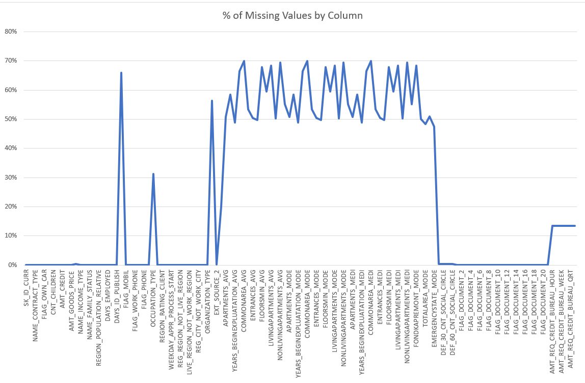

### ✅ Outcome:
Data became cleaner and more structured, ready for further analysis.

---

## 📉 Task B – Identify Outliers in the Dataset

### 🔍 Objective:
To understand unusual customer behaviors, detect and visualize extreme values in financial variables without removing them.

### 📊 Variables Analyzed:
- `AMT_INCOME_TOTAL`
- `AMT_CREDIT`
- `AMT_ANNUITY`
- `AMT_GOODS_PRICE`

### 🧰 Methodology:
- Used **Power Query** to clean and format amount columns
- Created **Box Plots** in Excel to:
  - Show min, Q1, median, Q3, max
  - Identify outliers beyond 1.5 × IQR

### 📌 Key Findings:
- Clear outliers in `AMT_INCOME_TOTAL` and `AMT_CREDIT`
- Outliers were **not removed**, just flagged

### 📈 Visualization:
- Box plots visually displayed the spread and outliers for each financial column
  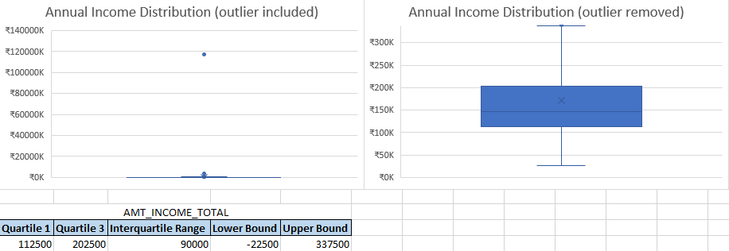
  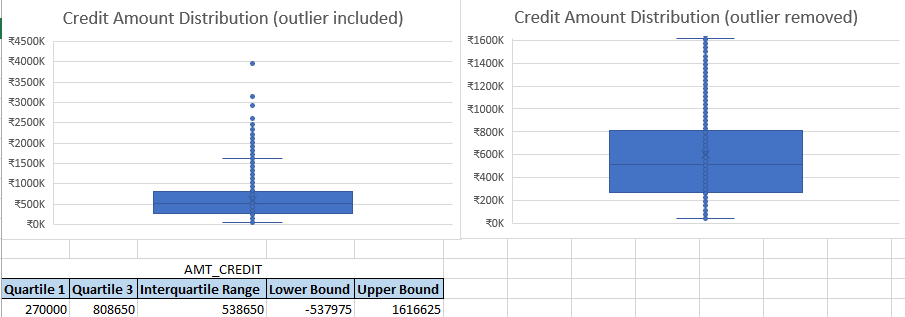
  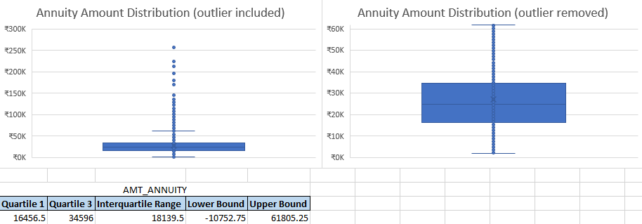
  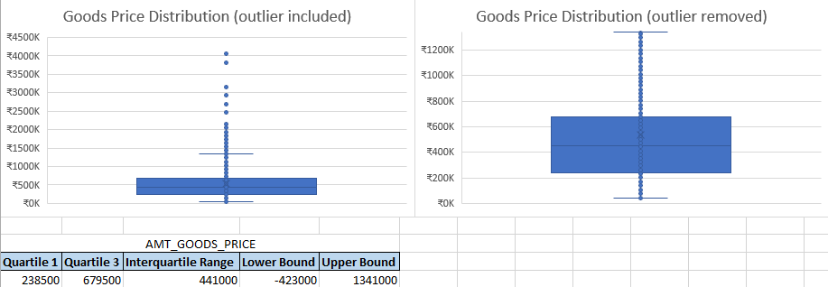

### 💡 Insight:
Some customers have unusually high loan amounts and incomes. These may indicate either higher risk or special cases that need careful review.

---

## ⚖️ Task C – Analyze Data Imbalance

### 🔍 Objective:
Check whether the dataset has a balanced distribution of loan repayment statuses.

### 🧰 Methodology:
- Created a **Pivot Table** in Excel to count:
  - Customers who **Repaid**
  - Customers who **Defaulted**
- Used a **Pie Chart** for visual representation

### 📈 Results:
- **92%** of customers **Repaid**
- Only **8%** **Defaulted**
  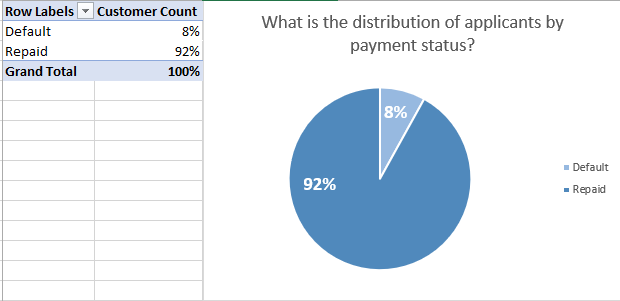

### 📌 Insight:
- The dataset is **highly imbalanced**, with defaulters underrepresented.
- This imbalance must be considered in future predictive modeling, as it can bias results toward the majority class (Repaid).

---

## 📊 Task D – Perform Univariate, Segmented Univariate, and Bivariate Analysis

---

### 🔹 D.1 – Univariate Analysis (Occupation)

#### 🎯 Objective:
Understand how customer occupations are distributed.

#### 🧰 Methodology:
- Used Excel **Pivot Table** to calculate % of customers in each occupation
- Created a **Column Chart** to visualize the distribution

#### 📈 Key Insights:
- **31.31%** of customers had occupation marked as "**Unknown**"
- **Laborers (17.90%)** and **Sales staff (10.32%)** were next most common
  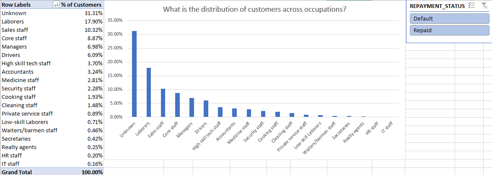
- **25% of defaulters** belonged to the "Unknown" group → **potential risk**
  
  

---

### 🔹 D.2 – Segmented Univariate Analysis

#### 🔸 Age vs Repayment Status

- Pivot Table segmented **age groups by repayment status**
- **Clustered Column Chart** used to compare segments
- **Highest default rate** seen in age **31–40**
- Youngest and oldest customers had **lower default rates**
  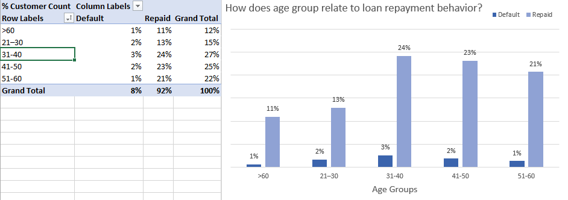

#### 🔸 Credit Amount vs Region Rating

- Pivot with slicers: **Unemployed + Defaulted** customers
- Average credit by **region rating**
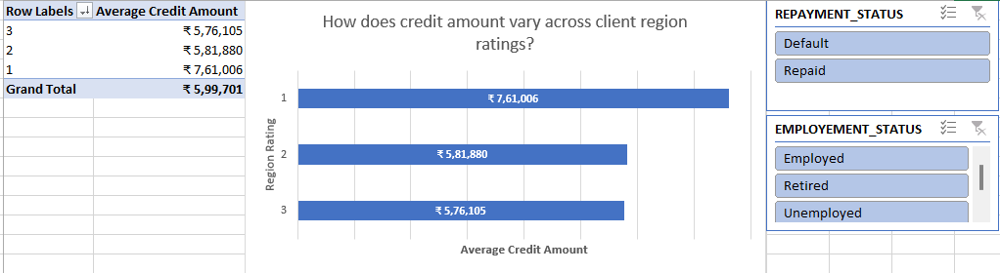
- Found that in **region 3**, **unemployed defaulters** had **₹7.83 lakh** average credit → higher than other regions
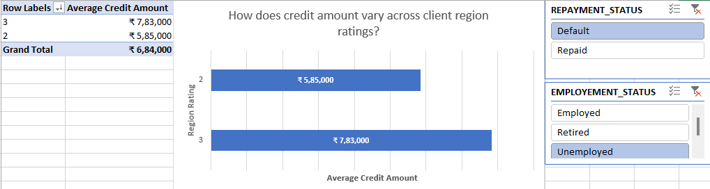

#### 🔸 Credit Amount vs Education

- Pivot Table of **average credit by education**
- Used **Funnel Chart** to visualize
- Loan amount **increased with education**, from ₹5.14L (Lower Secondary) to ₹7.84L (Academic Degree)
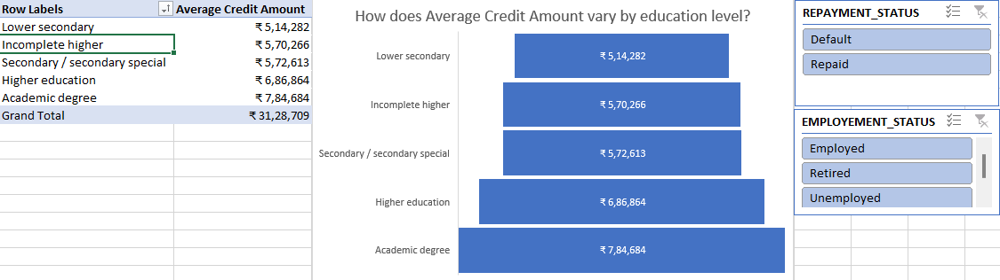
---

### 🔹 D.3 – Bivariate Analysis

#### 🔸 Income by Gender and Repayment

- Pivot: **Median income** grouped by **gender + repayment status**
- Clustered chart showed:
  - Males who repaid: **₹1,80,000**
  - Males who defaulted: **₹1,57,500**
  - Female income remained same regardless of repayment
  - Unknown gender group had higher repaid income
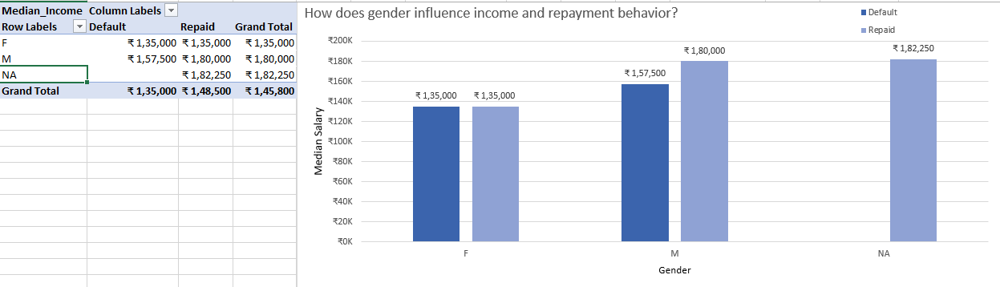

#### 🔸 Income vs Credit by Occupation

- Pivot Table of **occupation vs median income + credit**
- **Line Chart** created to show trends
- **Managers, Accountants, IT staff** had **higher income & credit**
- **Laborers, Unknown** had **lower** values
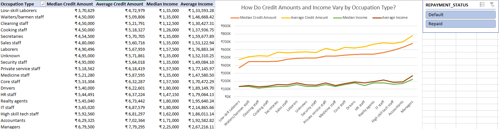

---
---

## 📈 Task E – Identify Top Correlations for Different Scenarios

---

### 🎯 Objective:
Analyze which numerical variables are most strongly related for two groups:
- Clients who **defaulted**
- Clients who **repaid** loans successfully

---

### 🧰 Methodology:

1. **Segmentation:**
   - Split dataset into:
     - 💸 **Defaulted clients**
     - ✅ **Repaid clients**

2. **Correlation Calculation:**
   - Used Excel's `CORREL` function to analyze relationships between key numerical variables:
     - AGE
     - CNT_CHILDREN
     - AMT_INCOME_TOTAL
     - AMT_CREDIT
     - AMT_ANNUITY
     - AMT_GOODS_PRICE
     - YEARS_EMPLOYED

3. **Visualization:**
   - Created **Correlation Matrices** for each segment
   - Highlighted strong correlations for quick comparison

---

### 🔍 Key Findings:

#### 🔻 Clients with Payment Difficulties (Defaults):

- **AMT_CREDIT ↔ AMT_GOODS_PRICE**: **0.98** → extremely high
- **AMT_CREDIT ↔ AMT_ANNUITY**: **0.75**
- **AGE**: Weak or no correlation with financial variables
- **CNT_CHILDREN ↔ AGE**: **-0.25** → younger defaulters had more children
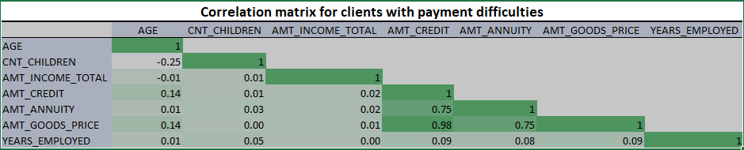

#### ✅ Clients Who Repaid:

- **AMT_CREDIT ↔ AMT_GOODS_PRICE**: **0.99** → highest correlation
- **AMT_INCOME_TOTAL ↔ AMT_ANNUITY**: **0.47**
- **AMT_INCOME_TOTAL ↔ AMT_GOODS_PRICE**: **0.41**
- **CNT_CHILDREN ↔ AGE**: **-0.33** → stronger than in default group
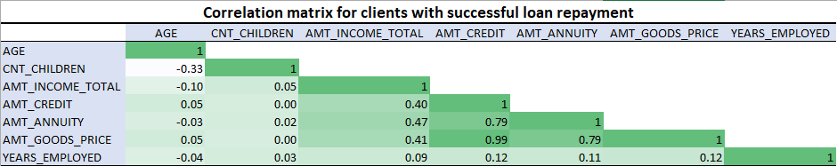
---

### 💡 Insights:
- Across both groups, **credit amount and goods price** are tight

### 💡 Overall Insights:
- **Occupation**, **age**, **region**, **education**, and **income** significantly impact loan decisions
- Segment-based insights can improve credit scoring and risk analysis

---

---

## 📁 Project Summary & How to Use This Project

---

### 📝 Summary:
This project provides an in-depth **Exploratory Data Analysis (EDA)** on a real-world bank loan dataset to understand factors influencing loan repayment and default risks among urban customers. The analysis covers:

- Handling missing data  
- Outlier identification  
- Data imbalance analysis  
- Univariate, segmented, and bivariate analysis  
- Correlation analysis by repayment segments  

Excel (2021) was used for data cleaning, visualization, and analysis.

---

### 📂 Accessing the Dataset

The Excel workbook containing raw data, cleaned data, pivot tables, charts, and dashboards is available here:

[🔗 Bank Loan Dataset Excel File (Google Drive)](https://docs.google.com/spreadsheets/d/1aBUMQFu-CSSwJ5nWwv_nFGSv8iR1bN-o/edit?usp=sharing&ouid=104040675759878910661&rtpof=true&sd=true)

---

### 🚀 How to Use This Project:

1. Download or open the Excel workbook from the Google Drive link.
2. Explore the sheets containing raw data, cleaned data, and different analysis tasks.
3. Use the pivot tables and charts as templates to modify or add your own analysis.
4. Refer to this README for explanations and insights on each task.
5. Use Excel 2021 or later for full compatibility with Power Query and chart features.

---

Thank you for visiting this project!  
Happy analyzing! 📊📈

