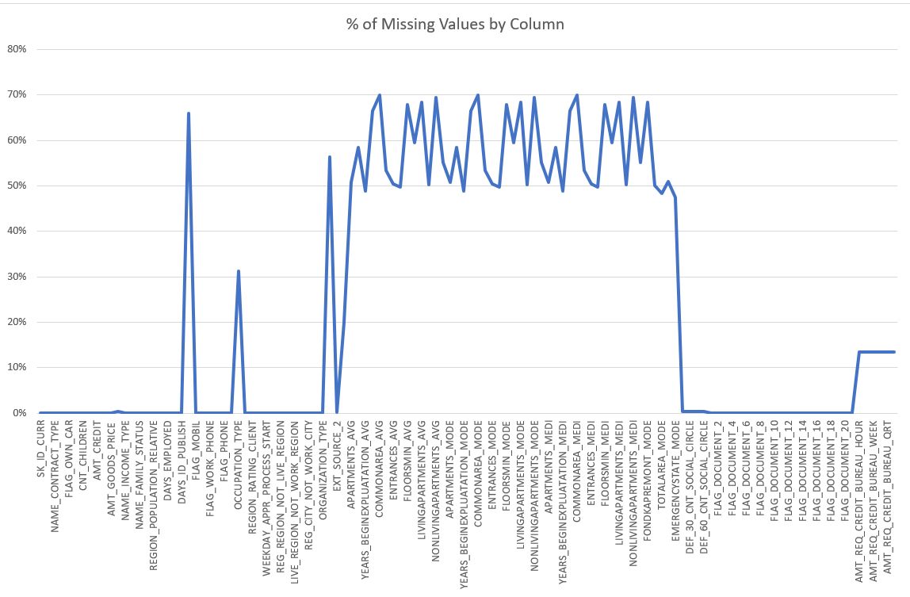

# Bank Loan Case Study 📊

## Project Overview

This is a side project aimed at upskilling in data analysis using Microsoft Excel. The goal of this case study is to explore patterns and insights from urban loan applicants to understand loan repayment behaviors and help identify key risk indicators. 

The analysis was conducted using a real-world loan dataset and includes data cleaning, univariate and bivariate analysis, handling of missing data, outlier detection, data imbalance study, and correlation insights — all implemented through Excel-based techniques like Pivot Tables, charts, Power Query, and dashboards.

## 🎯 Project Objectives

- Understand the repayment behavior of urban loan applicants.
- Identify key variables linked to loan default and repayment.
- Clean, transform, and visualize real-world data using Excel.
- Derive insights from univariate, segmented, and bivariate analysis.
- Evaluate patterns of outliers, data imbalance, and correlations.
- Support fair and data-driven lending decisions using evidence.

---

## 🛠️ Tools & Tech Stack

- **Microsoft Excel 2021**: 
  - Pivot Tables
  - Charts & Visualizations (Pie, Column, Box, Funnel, Line)
  - Power Query for ETL (Extract, Transform, Load)
  - Excel functions (IF, COUNTBLANK, CORREL, AVERAGE, MEDIAN, etc.)
- **Microsoft Word**:
  - For compiling the project report

---

## 🧹 Task A – Identify & Handle Missing Data

### 🔍 Objective:
Identify and clean missing data to ensure accurate analysis.

### 🛠️ Methods Used:
- **Power Query (ETL)**:
  - Removed irrelevant columns
  - Renamed for clarity
  - Created new fields:
    - `AGE` (from `DAYS_BIRTH`)
    - `YEARS_EMPLOYED` (from `DAYS_EMPLOYED`)
- **Excel Functions**:
  - `COUNTBLANK()` to count missing values
  - `IF()` to classify missing vs complete
  - Calculated percentage of missing data per column

### 💡 Handling Strategy:
- Dropped columns with high % of missing values
- Filled small gaps using:
  - `AVERAGE()` for normally distributed data
  - `MEDIAN()` for skewed data or outliers

### 📈 Visualization:
- A **line chart** was created showing missing % per column.
- Helped decide what to clean and what to retain.
- 

### ✅ Outcome:
Data became cleaner and more structured, ready for further analysis.
